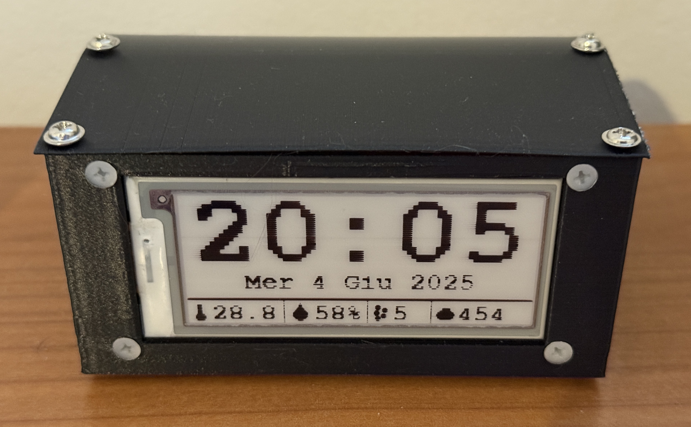
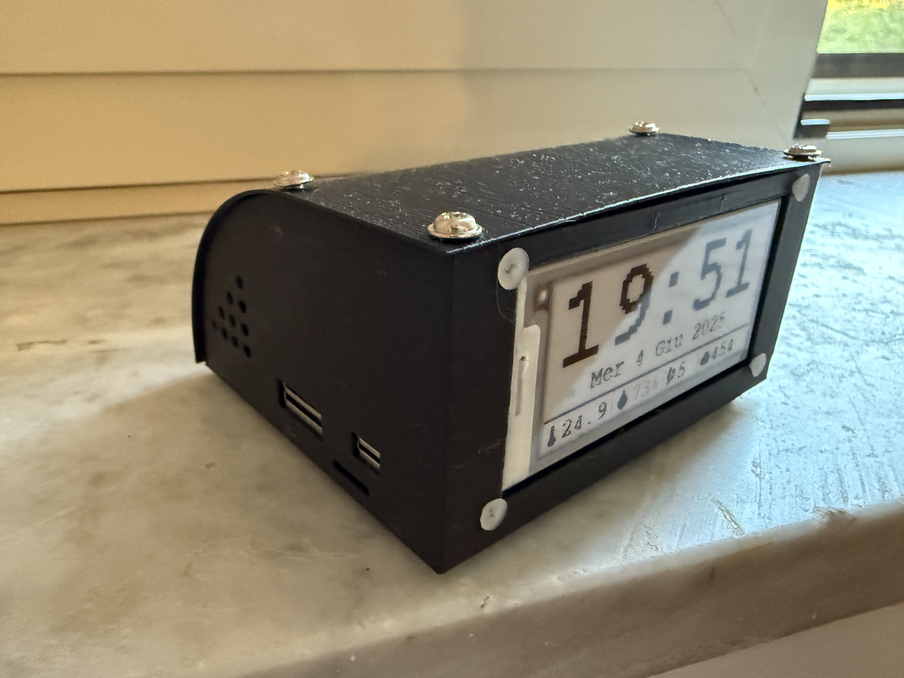
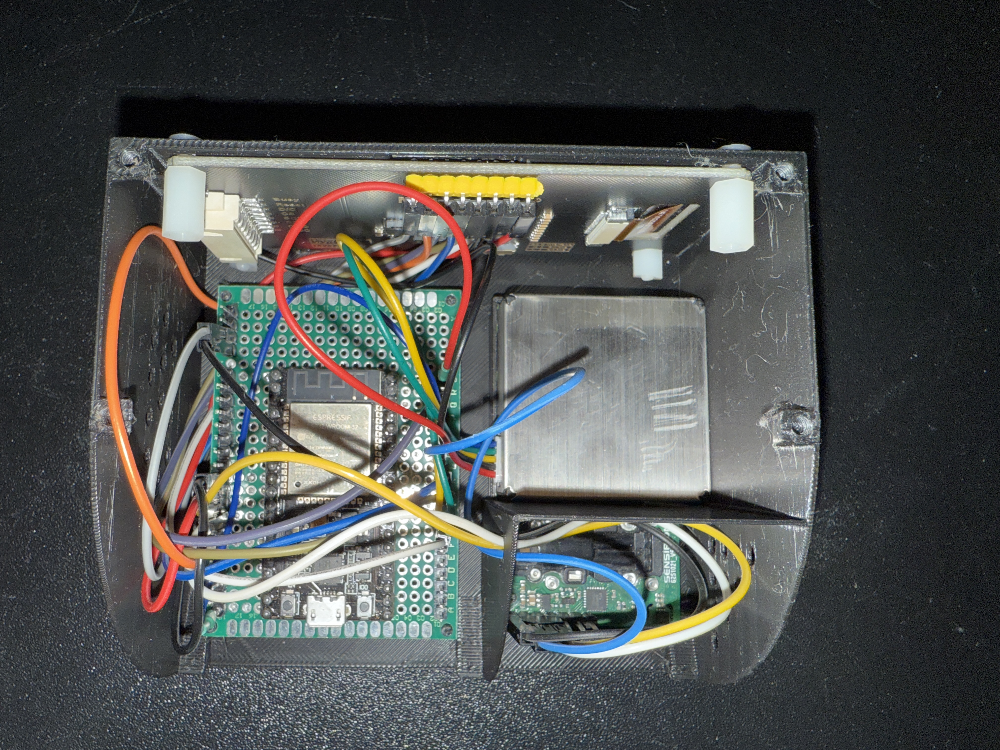
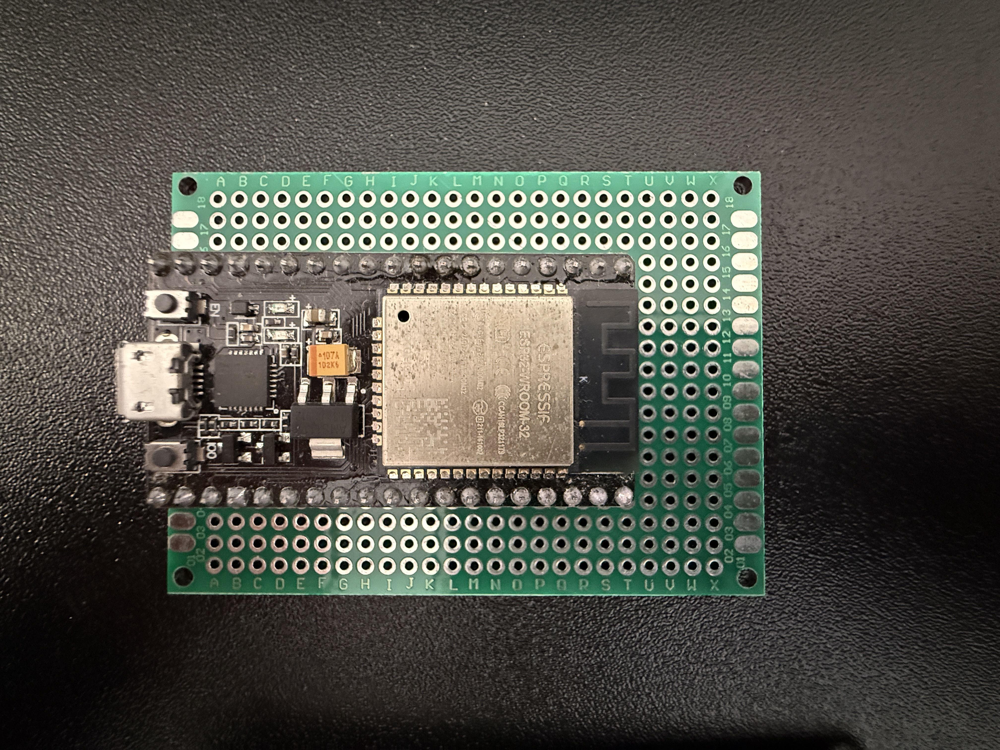

# 🌬️ AirCheck v1.0

An ESP32-based project to monitor air quality (PM1, PM2.5, PM4, PM10, CO₂, temperature, and humidity), displaying data on an e-paper screen and optionally sending it to ThingSpeak.






## 🛠️ Main Features

- 🔎 **Supported Sensors:**
- [SCD30](https://www.sensirion.com/en/environmental-sensors/carbon-dioxide-sensors/co2-sensors-scd30/) for CO₂, temperature, and humidity
- [SPS30](https://www.sensirion.com/en/environmental-sensors/particulate-matter-sensors-pm25/) for particulate matter (PM1, PM2.5, PM4, PM10)
- 📡 **Wi-Fi Configuration** via [WiFiManager]
- 🕒 NTP time synchronization with configurable timezone
- 🖼️ **2.9" E-Paper Display** (GDEW029Z10, 3-color)
- ☁️ Optional data sending to [ThingSpeak] (https://thingspeak.com/) (Create your account and just uncomment a line and insert your API key)

## 🧰 Required Hardware

- ESP32 Dev Board
- 2.9" 3-color E-paper Display (GDEW029Z10)
- Sensirion SPS30 (particulates)
- Sensirion SCD30 (CO₂, temperature, humidity)
- Breadboard and jumper wires
- USB Power Supply

## 📦 Required Libraries

Make sure these libraries are installed in the Arduino IDE:

- WifiManager by tzapu - https://github.com/tzapu/WiFiManager
- Sensirion I2C SCD30 by Sensirion (install its dependencies too) - https://github.com/Sensirion/arduino-i2c-scd30
- GxEPD2 by Jean Marc Zingg (install its dependencies too) - https://github.com/ZinggJM/GxEPD2
- sps30 by paulvha (not found on library manager) - https://github.com/paulvha/sps30

## 📐 Wiring (Pinout)

| Component     | ESP32 Pin |
|---------------|-----------|
| SCD30 SDA     | 27        |
| SCD30 SCL     | 14        |
| SPS30 TX      | 16        |
| SPS30 RX      | 17        |
| E-Paper CS    | 5         |
| E-Paper DC    | 25        |
| E-Paper RST   | 26        |
| E-Paper BUSY  | 4         |

## 🚀 Quick Start

1. **Clone or download** this repository.
2. Open the `.ino` file in Arduino IDE.
3. Install all the **required libraries** listed above.
4. Wire the sensors and display according to the pinout.
5. To enable ThingSpeak, uncomment the following line in the code:

   ```cpp
   //#define SEND_DATA_TO_THINGSPEAK
   ```

   Then insert your API key:

   ```cpp
   String thing_api_key = "INSERT_YOUR_API_KEY";
   

6. Compile and upload the code to your ESP32.

## 🖥️ Display Interface

Every 60 seconds, the e-paper screen shows:

- 🕒 Time and date
- 🌡️ Temperature (shown in red if >33°C)
- 💧 Humidity (red if >65%)
- 🌫️ PM10 (red if >25 µg/m³)
- 🫁 CO₂ (red if >750 ppm)

## 🌍 Timezone Configuration

You can change the timezone here:

```cpp
const char* timeZone = "CET-1CEST,M3.5.0/2,M10.5.0/3"; 
```

See: [Time Zone Abbreviations](https://remotemonitoringsystems.ca/time-zone-abbreviations.php)

## 📤 ThingSpeak Integration (Optional)

If enabled, the following data is sent:

- PM1 / PM2.5 / PM4 / PM10
- Average particle size
- CO₂
- Temperature
- Humidity

## 🧪 Project Status

✅ Fully working  
🔧 Under development for future features (e.g., SD card saving, alarms)

## 📄 License

This project is licensed under the **MIT License**. Feel free to modify and distribute with attribution.

---

**Author:** *imaurus - mau.091*  
**Version:** 1.0
```
